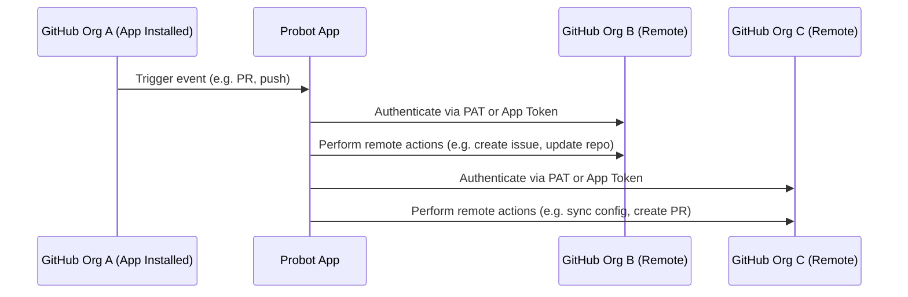

# pan-org

A GitHub App built with [Probot](https://github.com/probot/probot) that can operate across multiple ORGs (“Pan” &#x3D; across all)

To enable a GitHub App to operate on organizations other than the one where it is installed, it must use an access token with appropriate permissions for those organizations. There are two main approaches to achieve this:
- **Use a Personal Access Token (PAT):**

  Provide a PAT that has been granted access to each target organization. This requires that **the PAT be explicitly authorized in every organization it needs to interact with.**

- **Use an App Installation Token:**

  Obtain an installation token from the GitHub App as installed in the target organization. To do this, you must have the App's private key and App ID. Additionally, **the App must have the necessary permissions to perform the intended operations within that organization.**

By design, **GitHub Apps only receive webhook events from the organization in which they are installed**. This means the App cannot react to events in other organizations. It is only triggered by events in the host organization and can then **perform remote operations on other organizations**.

#### Sequence Diagram



---

## Setup

```sh
# Install dependencies
npm install

# Run the bot
npm start
```

## Docker

```sh
# 1. Build container
docker build -t pan-org .

# 2. Start container
docker run -e APP_ID=<app-id> -e PRIVATE_KEY=<pem-value> pan-org
```

## Contributing

If you have suggestions for how pan-org could be improved, or want to report a bug, open an issue! We'd love all and any contributions.

For more, check out the [Contributing Guide](CONTRIBUTING.md).

## License

[ISC](LICENSE) © 2025 Jürgen Efeish
